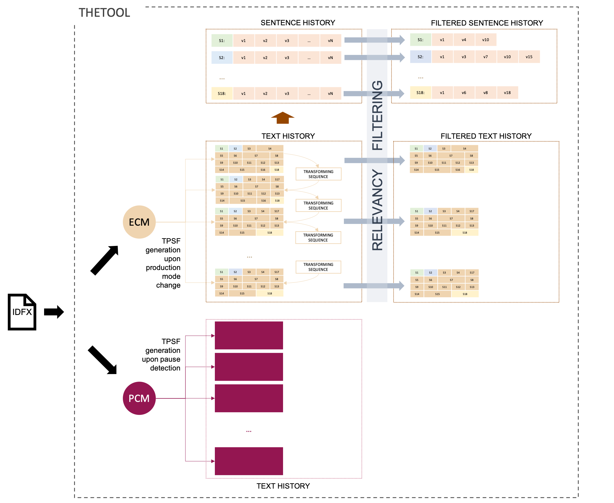

# Text History Extraction Tool (THEtool). A tool for Linguistic Modeling of Written Text Production

An open-source application implemented in Python for parsing raw keystroke logging data from a writing session, processing it to retrieve all relevant text versions produced during this session, and eventually generating text and sentence histories based on the collected information.

The input file processed by the tool is an idfx file in XML format.

The tool uses two main modes to capture text versions from idfx files:
* the Pause Capturing Mode (PCM), which relies on a preset pause duration in the text production to yield versions,
* and the Edit Capturing Mode (ECM), which uses a change production mode to determine versions. A  change  in  production  mode  is  defined  as switching between one of the modes (a) writing at the edge of the text, (b) deleting something, (c) inserting something.

## Tool Outputs TODO

The main outputs of the tool are:
* text history in ECM in JSON format
* all text versions in ECM exported to TXT format
* visualisation of text history in ECM in SVG format
* text history in PCM in JSON format
* sentence history in JSON format
* sentence history visualisation in SVG format

In case filtering has been activated in the configuration:
* filtered text history in JSON format
* filtered text versions exported to TXT format
* filtered sentence history in JSON format
* visualisation of filtered text history in ECM in SVG format
* filtered sentence history visualisation in SVG format

## Processing Pipeline

The central building block of the tool is TPSF. It is a data type for storing the text version together with further details retrieved from the processed keystroke logging data.

Generating a TPSF comprises the following steps:
* First the input file is parsed and the keystroke logging data is processed to capture all details on the particular text version.
* This data is next stored in a TPSF data structure and subsequently used to retrieve information on the sentences constituting this version.
* Finally, the version is evaluated for its morphosyntactic relevance.

In each step, the TPSF is enriched with the newly collected details.

An accomplished collection of TPSFs results in a text history which constitutes the basis for another output: the sentence history. Based on the relevancy label of each TPSF, both the text and the sentence history can be filtered.

The following figure provides an overview of the processing steps.



An example of a TPSF exported to JSON format:

```
{
	"revision_id": 4,
	"previous_text_version": "An edit operation is an act of either removing or inserting a sequence. ",
	"preceding_pause": 0.54,
	"result_text": "An edit operation is an act of either removing or inserting a sequence without interruption. ",
	"edit": {
		"edit_start_position": 70,
		"transforming_sequence": {
			"label": "insertion",
			"text": " without interruption",
			"tags": [
				{"text": " ", "pos": "SPACE", "pos_details": "_SP", "dep": "", "lemma": " ", "oov": false, "is_punct": false, "is_space": true},
				"text": "without", "pos": "ADP", "pos_details": "IN", "dep": "ROOT", "lemma": "without", "oov": false, "is_punct": false, "is_space": false},
				"text": "interruption", "pos": "NOUN", "pos_details": "NN", "dep": "pobj", "lemma": "interruption", "oov": false, "is_punct": false, "is_space": false},
				]
	},
	"sentences": {
		"previous_sentence_list": [
			{
				"text": "An edit operation is an act of either removing or inserting a sequence. ",
				"start_index": 0,
				"end_index": 70,
				"revision_id": 3,
				"pos_in_text": 0
			}
		],
		"current_sentence_list": [
			{
				"text": "An edit operation is an act of either removing or inserting a sequence without interruption. ",
				"start_index": 0,
				"end_index": 91,
				"revision_id": 3,
				"pos_in_text": 0,
				"label": "modified"
			},
		"new_sentences": [],
		"edited_sentences": [
			{
				"previous_sentence": {
					"text": "An edit operation is an act of either removing or inserting a sequence. ",
					"start_index": 0,
					"end_index": 70,
					"revision_id": 3,
					"pos_in_text": 0
				},
				"current_sentence": {
					"text": "An edit operation is an act of either removing or inserting a sequence without interruption. ",
					"start_index": 0,
					"end_index": 91,
					"revision_id": 3,
					"pos_in_text": 0,
					"label": "modified"
				}
			}
		],
		"deleted_sentences": [],
		"unchanged_sentences": []
	},
	"morphosyntactic_relevance_evaluation": [
		"number_affected_tokens": 3,
		"affected_tokens": [
			{"prev_tok": ("sequence.", 62, 70), "cur_tok": ("sequence", 62, 69)},
			{"prev_tok": ("", null, null), "cur_tok": ("without", 71, 77)},
			{"prev_tok": ("", null, null), "cur_tok": ("interruption.", 79, 91)},
		]
		"is_any_tok_oov": false,
		"edit_distance": 21
	],
	"morphosyntactic_relevance": true
}

```

For supplementing the analysis with relevant linguistic annotations, we apply [spaCy](https://spacy.io), an open-source Python software library for advanced natural language processing.  spaCy offers a set of trained pipeline packages for multiple languages.  We used four of them: ```en_core_web_md``` for processing English texts, ```de_core_news_md``` for German, ```fr_core_news_md``` for French, and ```el_core_news_md``` for Greek.

## Tool Configuration

Several parameters related to TPSF generation are configurable. These are:
* ```ksl_source_format```: either "scriptlog_idfx" (an xml file produced by Scriptlog) or "inputlog idfx" (an xml file produced by Inputlog)
* ```ksl_files```: a list of paths to idfx files containg keystroke logs to be parsed
* ```output_dir```: path to the directory where all output files should be stored
* ```final_txt```: path to the directory where the final text produced during the writing session should be stored
* ```pause_duration```: the duration of the pause that should trigger TPSF generation in PCM mode, default = 2
* ```language```: Languages.EN (for English), Languages.DE (for German), Languages.FR (for French), Languages.GR (for Greek)
The following parameters are also part of theTOOL configuration and are applied for *morphosyntactic relevance evaluation* of TPSFs:
* ```min_edit_distance```: the minimum edit distance between two TPSFs which makes a TPSFs morphosyntactically relevant, default = 3
* ```ts_min_tokens_number```: the minimum number of tokens in a transforming sequence which makes a TPSFs morphosyntactically relevant, default = 2
* ```combine_edit_distance_with_tok_number```: by default the min_edit_distance is not taken into account, if the difference between versions contains more than one token. In such case a TPSFs is considered morphosyntactically relevant even if the edit distance is less than the min_edit_distance. Set this parapeter to true if you want THEtool to check min_edit_distance even if the transforming sequence contains more than 1 token
* ```enable_spellchecking```: set this parameter to true if you want THEtool to classify a TPSF *morphosyntactically irrelevant* if it contains a spelling error
* ```include_punctuation_edits```: set this parameter to true if you want THEtool to classify a TPSF morphosyntactically irrelevant if the transformation consists only in removing or adding punctuation marks

The configuration file ```config.py``` is stored in the tool root directory. You can define multiple configurations in the configuration file.

The configuration structure:

```
<YOUR CONFIGURATION NAME> = {
    "ksl_source_format": '',
    "ksl_files": (),
    "output_dir": '',
    "final_txt": '',
    "pause_duration": int,
    "min_edit_distance": int,
    "ts_min_tokens_number": int,
    "combine_edit_distance_with_tok_number": bool,
    "enable_spellchecking": bool,
    "include_punctuation_edits": bool,
    "language": ''
}
```

## Running the Tool

* To install all dependencies install [poetry](https://python-poetry.org/), run:

```
poetry install
```

* To run the tool, execute:

```
poetry run wta config.<YOUR CONFIGURATION NAME>
```

To run the tool for the provided **example data** (seven idfx files with short descriptive comments created by seven subjects after watching a two-minute video), execute the following command:

```
poetry run wta config.VIDEO
```

By default, the tool will create a directory ```wta``` in the user's home directory where it will store the output files. The output path can be changed by modifying the ```output_path```in the ```VIDEO``` configuration in ```config.py```.

## Key Terms and their Definitions

**TPSF (text produced so far)**: The text under production that has been produced up to the given moment in time. THEtool stores a given TPSF version as soon as a change in production mode occurs. A change in production mode is defined as switching between one of the modes (a) continuous writing at the leading edge of the TPSF (i.e., append) ignoring white insertions, (b) continuous deletion of something, (c) continuous insertion of something into existing text.

**TRANSFORMING SEQUENCE (TS)**: The textual material (i.e., product data) combined with the edit operations (i.e., process data) that comprises the difference between two adjacent versions.

**TEXT HISTORY (texthis)**: The text history comprises all TPSF versions captured throughout the tracking of the text production process.

**TEXT UNIT (TU)**: In order to accurately track the content of each TPSF version, we propose the concept of a text unit. We consider that the full content of a given text version can be split into text units in such a way that each character produced, including whitespaces, belongs to one text unit. We distinguish between two main types of text units: SPSFs and interspace.

**SENTENCEHOOD DEGREE**: A set of properties of a text unit which indicates to what extend the given text unit can be classified as a sentence. We distinguish between 5 sentencehood criteria: mechanical completeness, conceptual completeness, syntactic completeness, mechanical correctness, and grammatical correctness.

**SPSF (sentence produced so far)**: A text unit which holds textual content as opposed to an interspace, which is used to separate SPSFs from each other and to structure the text. In order to distinguish between full-fledged sentences and sequences of characters that do not meet the sentencehood criteria, we introduce two types of SPSFs: a sentence (SEN) and a sentence candidate (SEC).

**SENTENCE (SEN)** We interpret the writer’s behaviour as follows: the writer indicates the beginning of a sentence by capitalising its first letter and indicates its end by entering a final punctuation mark (“.”, “?”, or “!”). Following this interpretation, we define a SEN a sequence of characters that starts with a capital letter and ends with sentence-final punctuation. Once a sequence of characters has been identified as a sentence, its status remains unchanged as long as the writer does not clearly signal a revision of the sentence scope by removing the capitalisation of the initial letter or adjusting the final punctuation mark. In other words, as long as the sentence frame stays untouched, we treat the sequence of characters within this frame as a sentence, even if other sentencehood criteria are not satisfied.

**SENTENCE CANDIDATE (SEC)**: a sequence of characters that does not start with a capital letter and/or does not end in sentence-final punctuation. In other words, it fails the mechanical completeness criterion. A sentence candidate can
appear in different positions in a TPSF: (a) between the beginning and the edge of the text or (b) between a sentence interspace or paragraph interspace and the edge of the text or (c) between the beginning of the text and a sentence or a paragraph interspace or (d) between a sentence interspace or paragraph interspace and a sentence or (e) between two paragraph interspaces or (f) between two sentences.

**INTERSPACE**: A text unit used to separate SPSFs from each other and structure the text.

**SENTENCE INTERSPACE (SIN)**: A SIN is typically built of space characters and intervenes between SPSFs.

**PARAGRAPH INTERSPACE (PIN)**: A PIN is typically comprised of newline characters and possibly indentation signalling the boundary between two paragraphs.

**SENTENCE HISTORY (senhis)**: A sentence history is created for each of the sentences. This also includes sentences that are not part of the final product due to a revision. A single sentence history contains all versions of a particular sentence in chronological order.

**MORPHOSYNTACTIC RELEVANCE**: According to our definition, a TPSF or an SPSF version is morphosyntactically relevant if: 
* the edit distance between the current and the previous version is larger than 3 (note: it is only relevant if the difference between the versions contains one token; the edit distance is NOT taken into account, if the difference between versions contains multiple tokens),
* the transformation does not consist only in adding or removing punctuation marks,
* the resulting version does not contain any spelling errors.

The definition can be adopted by changing the configuration parameters related to morphosyntacic relevance evaluation (see section Tool Configuration).


## Citation

If you use THEtool, please cite our paper [Extraction of transforming sequences and sentence histories from writing process data: a first step towards linguistic modeling of writing](https://doi.org/10.1007/s11145-021-10234-6) as follows:

```
@article{mahlow_extraction_2024,
	title = {Extraction of transforming sequences and sentence histories from writing process data: a first step towards linguistic modeling of writing},
	volume = {37},
	issn = {1573-0905},
	url = {https://doi.org/10.1007/s11145-021-10234-6},
	doi = {10.1007/s11145-021-10234-6},
	abstract = {Producing written texts is a non-linear process: in contrast to speech, writers are free to change already written text at any place at any point in time. Linguistic considerations are likely to play an important role, but so far, no linguistic models of the writing process exist. We present an approach for the analysis of writing processes with a focus on linguistic structures based on the novel concepts of transforming sequences, text history, and sentence history. The processing of raw keystroke logging data and the application of natural language processing tools allows for the extraction and filtering of product and process data to be stored in a hierarchical data structure. This structure is used to re-create and visualize the genesis and history for a text and its individual sentences. Focusing on sentences as primary building blocks of written language and full texts, we aim to complement established writing process analyses and, ultimately, to interpret writing timecourse data with respect to linguistic structures. To enable researchers to explore this view, we provide a fully functional implementation of our approach as an open-source software tool and visualizations of the results. We report on a small scale exploratory study in German where we used our tool. The results indicate both the feasibility of the approach and that writers actually revise on a linguistic level. The latter confirms the need for modeling written text production from the perspective of linguistic structures beyond the word level.},
	number = {2},
	journal = {Reading and Writing},
	author = {Mahlow, Cerstin and Ulasik, Malgorzata Anna and Tuggener, Don},
	month = feb,
	year = {2024},
	pages = {443--482},
}
```
