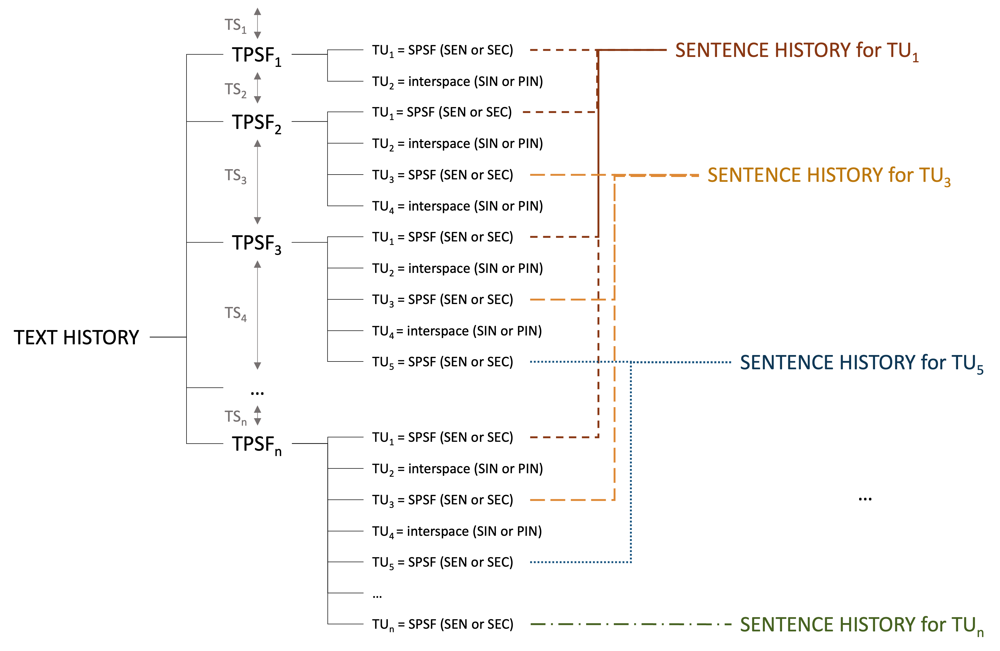

# Text History Extraction Tool (THEtool) <br>A tool for Linguistic Modeling of Written Text Production

An open-source application implemented in Python for parsing raw keystroke logging data from a writing session, processing it to retrieve all relevant text versions created during this session (*text history*), extracting intermediate versions of all produced sentences (*sentence histories*), as well as capturing writing bursts (*burst history*, planned for future releases of the application).

The input file processed by the tool is an idfx file in XML format.

#### Main Theoretical Considerations

The foundation for the writing modeling implemented in THEtool is the following consideration: writing bursts, revision episodes, and sentences can be seen as three separate layers of the writing process impacting each other. Writing bursts can be interrupter by a) revision episodes or in an abstract sense b) by final punctuation marks signaling sentence completion. Revisions can be interrupted by a) pauses as well as b) "split" by final punctuation marks and finally, producing a sentence can be interrupted by a) pauses and b) revisions. In our model, the layers are called *Burst Layer*, *Transformation Layer*, and *Sentence Layer* respectively. The information stored in one layer can be mapped on other layers. This allows for gaining new insights into the writing process, such as identifying syntactic structures within bursts and revisions, tracking pausing behavior during sentence production or revisions, as well as detecting revisions consituing writing bursts.

## Processing Pipeline

The main steps of the processing pipeline are described below. The terms marked in italics are explained in more detail in the section [Key Terms and Their Definitions](#key-terms-and-their-definitions) and in our papers (see [Related Papers](#related-papers)).

#### Transformation Layer Generation
1. First, the keystroke logs stored in the XML file are parsed. During parsing, every time a change in the production mode is detected, the character sequence between the previous and the current production mode change is stored as a *transforming sequence* (TS). A  change  in  production  mode  is  defined  as switching between one of the modes (a) writing at the edge of the text, (b) deleting something, (c) inserting something.
2. Not only the character sequence but also the information about the production mode, the start and end position of the cursor and further details are stored in the *TS* data structure. It contains all information logged in the XML file for ech keystroke. The data collected in a *TS* allows for tracking the whole text production process and extracting all text versions created between production mode changes.
#### Sentence Layer Initialization
3. As soon as the character sequence building each text version is extracted, it is subsequently split into *text units*. A *text unit* is either a sentence version (a so called *SPSF*; it may be a complete sentence: *SEN* or an unfinished sentence: *SEC*) or an *interspace* between sentences (*SIN*) or paragraphs (*PIN*).
#### Projecting Sentence Layer on Transformation Layer
4. Based on the content of the *transforming sequence*, the new, modified, and deleted *text units* are detected. 
5. In the further two processing steps (6 and 7 below), the *interspaces* are left out. For the projection of the sentence layer on the transformation layer, only the *SPSFs* (*SENs* or *SECs*) are relevant.
6. First, the *scope* of the transformation with regards to sentences is defined. Depending on the *scope* the transformation is assigned to one of four classes: *in-sentence*, *cross-sentence*, *multi-sentence* and *uni-sentence*. An *in-sentence* transformation impacts exactly one SPSF. A *uni-sentence* transformation results in producing a new SEN from scratch. The remaining two classes always impact more than one SPSF: *cross-sentence* transformation affects parts of exactly two SPSFs. A *multi-sentence* transformation impacts at least three SPSFs.
7. Next, it is identified which *segments* of SPSFs were impacted by the transformation. We distinguish between: *sentence beginning*, *sentence middle*, *sentence end*, and *whole sentence*.
#### Projecting Burst Layer on Transformation Layer
*under construction, planned for the next THEtool release*
#### Text History
8. Each text version together with a list of *text units* and the results of projecting sentence layer on the transformation layer is stored as a *TPSF* data structure.
9. Each *TPSF* is addinitally evaluated for its *morphosyntactic relevance* to enable filtering.
10. All extracted *TPSFs* constitute *text history*.
#### Extending Sentence Layer with Sentence Histories
11. The *text history* with extracted *text units* of each text version builds the basis for *sentence histories*. This is a perspective switch from the history of producing the text as a whole ("horizontal view"), to the history of producing a single sentence for all sentences in the text ("vertical view").
12. In order to create sentence histories, THEtool analyses all *SPSFs*: new, modified, deleted, as well as unchanged *SPSFs*.
13. Each *SPSF* identified as **new** gets a unique sentence ID and triggers a creation of a new *sentence history*. The new *sentence history* has the ID of the new sentence.
14. If an *SPSF* is modified in the subsequent text versions, its modified version is stored in its *sentence history*.
15. If an *SPSF* gets deleted at any point in time, this information is also stored in its *sentence history*.
16. If an *SPSF* stays unchanged, this information is also stored in its *sentence history*.
17. For each *SPSF* in a given *sentence history*, a sentence *TS* is detected. The *TS* is determined based on the content difference between two adjacent *SPSFs* in the *sentence history*.
18. Each SPSF is also checked for its *sentencehood* degree according to five criteria: *mechanical completeness*, *conceptual completeness*, *syntacic completeness*, *mechanical correctness*, and *grammatical correctness*.
19. All the collected information on the *SPSF* is stored as an *SPSF* data structure.
20. All versions of a given sentence (its *SPSFs*) are stored in its *sentence history*. There are as many *sentence histories* as sentences in the text produced in the given writing session. THEtool also outputs *sentence histories* for the deleted sentences.
#### Projecting Transformation Layer on Sentence Layer
19. The projection of *Transformation Layer* on *Sentence Layer* allows us to identify the *sentence production stage*. THEtool performs the projection for each *SPSF* in each *sentence history*. We distinguish between two productions stages of a sentence: *sentence initial draft* containing *pre-contextual operations* and *sentence revision draft* consisting of *contextual operations*.
20. Each *sentence history* stores the information about the production stages of all SPSFs, as well as the sentence segment impacted by the transformation (collected already in a processing step 7).
#### Projecting Burst Layer on Sentence Layer
*under construction, planned for the next THEtool release*
#### Burst Layer Generation
*planned for future releases*

For supplementing the analysis with relevant linguistic annotations, we apply [spaCy](https://spacy.io), an open-source Python software library for advanced natural language processing.  spaCy offers a set of trained pipeline packages for multiple languages.  We used four of them: ```en_core_web_md``` for processing English texts, ```de_core_news_md``` for German, ```fr_core_news_md``` for French, and ```el_core_news_md``` for Greek.

## Tool Configuration

Several parameters related to text and sentence history generation are configurable. These are:
* ```ksl_source_format```: either "scriptlog_idfx" (an xml file produced by Scriptlog) or "inputlog idfx" (an xml file produced by Inputlog)
* ```ksl_files```: a list of paths to idfx files containg keystroke logs to be parsed
* ```output_dir```: path to the directory where all output files should be stored
* ```final_txt```: path to the directory where the final text produced during the writing session should be stored
* ```pause_duration```: the duration of the pause that should trigger TPSF generation in PCM mode, default = 2
* ```language```: Languages.EN (for English), Languages.DE (for German), Languages.FR (for French), Languages.GR (for Greek)
The following parameters are also part of theTOOL configuration and are applied for *morphosyntactic relevance evaluation* of TPSFs:
* ```min_edit_distance```: the minimum edit distance between two TPSFs which makes a TPSFs morphosyntactically relevant, default = 3
* ```ts_min_tokens_number```: the minimum number of tokens in a transforming sequence which makes a TPSFs morphosyntactically relevant, default = 2
* ```combine_edit_distance_with_tok_number```: by default the min_edit_distance is not taken into account, if the difference between versions contains more than one token. In such case a TPSFs is considered morphosyntactically relevant even if the edit distance is less than the min_edit_distance. Set this parapeter to true if you want THEtool to check min_edit_distance even if the transforming sequence contains more than 1 token
* ```enable_spellchecking```: set this parameter to true if you want THEtool to classify a TPSF *morphosyntactically irrelevant* if it contains a spelling error
* ```include_punctuation_edits```: set this parameter to true if you want THEtool to classify a TPSF morphosyntactically irrelevant if the transformation consists only in removing or adding punctuation marks

The configuration file ```config.py``` is stored in the tool root directory. You can define multiple configurations in the configuration file.

The configuration structure:

```
<YOUR CONFIGURATION NAME> = {
    "ksl_source_format": '',
    "ksl_files": (),
    "output_dir": '',
    "final_txt": '',
    "pause_duration": int,
    "min_edit_distance": int,
    "ts_min_tokens_number": int,
    "combine_edit_distance_with_tok_number": bool,
    "enable_spellchecking": bool,
    "include_punctuation_edits": bool,
    "language": ''
}
```

## Running the Tool

* To install all dependencies install [poetry](https://python-poetry.org/), run:

```
poetry install
```

* To run the tool, execute:

```
poetry run wta config.<YOUR CONFIGURATION NAME>
```

To run the tool for the provided **example data** (seven idfx files with short descriptive comments created by seven subjects after watching a two-minute video), execute the following command:

```
poetry run wta config.VIDEO
```

By default, the tool will create a directory ```wta``` in the user's home directory where it will store the output files. The output path can be changed by modifying the ```output_path```in the ```VIDEO``` configuration in ```config.py```.

## Tool Outputs

Text history:
* text history in JSON format
* all text versions exported to TXT format
* visualisation of text history in SVG format

Sentence histories:
* sentence histories in JSON format
* sentence histories in TXT format
* sentence histories visualisation in SVG format

Sentencehood:
* a JSON containing the results of sentencehood evaluation for each SPSF in all sentence histories
* a TXT containing the results of sentencehood evaluation for each SPSF in all sentence histories

In case filtering has been activated in the configuration, THEtool also generates filtered versions of the text history and sentence histories.

Text history:
* filtered text history in JSON format
* filtered text versions exported to TXT format
* visualisation of filtered text history in ECM in SVG format

Sentence histories:
* filtered sentence histories in JSON format
* filtered sentence histories in TXT format
* filtered sentence histories visualisation in SVG format

## Key Terms and Their Definitions

**TPSF (text produced so far)**: The text under production that has been produced up to the given moment in time. THEtool stores a given TPSF version as soon as a change in production mode occurs. A change in production mode is defined as switching between one of the modes (a) continuous writing at the leading edge of the TPSF (i.e., append) ignoring white insertions, (b) continuous deletion of something, (c) continuous insertion of something into existing text.

**TRANSFORMING SEQUENCE (TS)**: The textual material (i.e., product data) combined with the edit operations (i.e., process data) that comprises the difference between two adjacent versions.

**TEXT HISTORY (texthis)**: The text history comprises all TPSF versions captured throughout the tracking of the text production process.

**TEXT UNIT (TU)**: In order to accurately track the content of each TPSF version, we propose the concept of a text unit. We consider that the full content of a given text version can be split into text units in such a way that each character produced, including whitespaces, belongs to one text unit. We distinguish between two main types of text units: SPSFs and interspace.

**SENTENCEHOOD DEGREE**: A set of properties of a text unit which indicates to what extend the given text unit can be classified as a sentence. We distinguish between 5 sentencehood criteria: mechanical completeness, conceptual completeness, syntactic completeness, mechanical correctness, and grammatical correctness.

**MECHANICAL COMPLETENESS**: It refers to the existence of a sentence frame: the capital letter at the beginning and the final punctuation mark at the end of a sentence6. The
classification of a sentence as mechanically complete is based on its surface representation, which is the visible product of writing.

**CONCEPTUAL COMPLETENESS**: We define the conceptual completeness of a sentence under production as a state when the writer seems to be satisfied with the sentence content. When working with keystroke logging data, we clearly do not know the writer’s intention. Hence, when deciding on a sentence’s conceptual completeness, we can only speculate. We base the speculations on writers’
behavioural data: when the writer puts a final punctuation mark at the end of a word sequence and moves on with the writing process by producing or editing a different sentence (as opposed to revising the current sentence), we interpret their behaviour as a signal that they consider the sentence as complete.

**SYNTACTIC COMPLETENESS**: We restrict our definition of syntactic completeness to the existence of a main clause with a lexical or pronominal subject and a predicate in the form of a finite verb form that agrees with the subject in person and number.

**MECHANICAL CORRECTNESS**: We classify a sentence as mechanically correct if it does not contain any punctuation, spelling, or capitalisation errors.

**GRAMMATICAL CORRECTNESS**: A grammatically correct sentence is a form which “should not be corrigible”. As we are working with sentences under production which often contain incomplete
grammatical structures, typos, and/or incomplete words, we limit the grammatical correctness check to the sequence of mechanically correct words and exclude the remaining words. We also do not take into consideration the completeness of the grammatical structure, meaning a sentence can be classified as grammatically correct even if missing obligatory constituents.

**SPSF (sentence produced so far)**: A text unit which holds textual content as opposed to an interspace, which is used to separate SPSFs from each other and to structure the text. In order to distinguish between full-fledged sentences and sequences of characters that do not meet the sentencehood criteria, we introduce two types of SPSFs: a sentence (SEN) and a sentence candidate (SEC).

**SENTENCE (SEN)** We interpret the writer’s behaviour as follows: the writer indicates the beginning of a sentence by capitalising its first letter and indicates its end by entering a final punctuation mark (“.”, “?”, or “!”). Following this interpretation, we define a SEN a sequence of characters that starts with a capital letter and ends with sentence-final punctuation. Once a sequence of characters has been identified as a sentence, its status remains unchanged as long as the writer does not clearly signal a revision of the sentence scope by removing the capitalisation of the initial letter or adjusting the final punctuation mark. In other words, as long as the sentence frame stays untouched, we treat the sequence of characters within this frame as a sentence, even if other sentencehood criteria are not satisfied.

**SENTENCE CANDIDATE (SEC)**: a sequence of characters that does not start with a capital letter and/or does not end in sentence-final punctuation. In other words, it fails the mechanical completeness criterion. A sentence candidate can
appear in different positions in a TPSF: (a) between the beginning and the edge of the text or (b) between a sentence interspace or paragraph interspace and the edge of the text or (c) between the beginning of the text and a sentence or a paragraph interspace or (d) between a sentence interspace or paragraph interspace and a sentence or (e) between two paragraph interspaces or (f) between two sentences.

**INTERSPACE**: A text unit used to separate SPSFs from each other and structure the text.

**SENTENCE INTERSPACE (SIN)**: A SIN is typically built of space characters and intervenes between SPSFs.

**PARAGRAPH INTERSPACE (PIN)**: A PIN is typically comprised of newline characters and possibly indentation signalling the boundary between two paragraphs.

**SENTENCE HISTORY (senhis)**: A sentence history is created for each of the sentences. This also includes sentences that are not part of the final product due to a revision. A single sentence history contains all versions of a particular sentence in chronological order.

**MORPHOSYNTACTIC RELEVANCE**: According to our definition, a TPSF or an SPSF version is morphosyntactically relevant if: 
* the edit distance between the current and the previous version is larger than 3 (note: it is only relevant if the difference between the versions contains one token; the edit distance is NOT taken into account, if the difference between versions contains multiple tokens),
* the transformation does not consist only in adding or removing punctuation marks,
* the resulting version does not contain any spelling errors.

The definition can be adopted by changing the configuration parameters related to morphosyntacic relevance evaluation (see section Tool Configuration).




## Citation

If you use THEtool, please cite our paper [Extraction of transforming sequences and sentence histories from writing process data: a first step towards linguistic modeling of writing](https://doi.org/10.1007/s11145-021-10234-6) as follows:

```
@article{mahlow_extraction_2024,
	title = {Extraction of transforming sequences and sentence histories from writing process data: a first step towards linguistic modeling of writing},
	volume = {37},
	issn = {1573-0905},
	url = {https://doi.org/10.1007/s11145-021-10234-6},
	doi = {10.1007/s11145-021-10234-6},
	abstract = {Producing written texts is a non-linear process: in contrast to speech, writers are free to change already written text at any place at any point in time. Linguistic considerations are likely to play an important role, but so far, no linguistic models of the writing process exist. We present an approach for the analysis of writing processes with a focus on linguistic structures based on the novel concepts of transforming sequences, text history, and sentence history. The processing of raw keystroke logging data and the application of natural language processing tools allows for the extraction and filtering of product and process data to be stored in a hierarchical data structure. This structure is used to re-create and visualize the genesis and history for a text and its individual sentences. Focusing on sentences as primary building blocks of written language and full texts, we aim to complement established writing process analyses and, ultimately, to interpret writing timecourse data with respect to linguistic structures. To enable researchers to explore this view, we provide a fully functional implementation of our approach as an open-source software tool and visualizations of the results. We report on a small scale exploratory study in German where we used our tool. The results indicate both the feasibility of the approach and that writers actually revise on a linguistic level. The latter confirms the need for modeling written text production from the perspective of linguistic structures beyond the word level.},
	number = {2},
	journal = {Reading and Writing},
	author = {Mahlow, Cerstin and Ulasik, Malgorzata Anna and Tuggener, Don},
	month = feb,
	year = {2024},
	pages = {443--482},
}
```

## Related Papers
* [Extraction of transforming sequences and sentence histories from writing process data: a first step towards linguistic modeling of writing](https://doi.org/10.1007/s11145-021-10234-6)
* [Automated Extraction and Analysis of Sentences under Production: A Theoretical Framework and Its Evaluation](https://www.mdpi.com/2226-471X/9/3/71)
